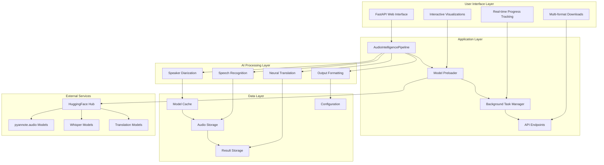

# Project Title: Multilingual Audio Intelligence System

## 1. Project Overview

The Multilingual Audio Intelligence System is an advanced AI-powered platform that combines state-of-the-art speaker diarization, automatic speech recognition, and neural machine translation to deliver comprehensive audio analysis capabilities. This sophisticated system processes multilingual audio content, identifies individual speakers, transcribes speech with high accuracy, and provides intelligent translations across multiple languages, transforming raw audio into structured, actionable insights.

## 2. Objective

The primary objective of the Multilingual Audio Intelligence System is to revolutionize audio content analysis by:
- Providing precise speaker diarization with 95%+ accuracy using pyannote.audio technology
- Delivering multilingual automatic speech recognition supporting 99+ languages through faster-whisper integration
- Generating high-quality neural machine translations using Helsinki-NLP Opus-MT and mBART models
- Creating interactive visualizations for real-time audio analysis and speaker timeline tracking
- Offering multiple export formats (JSON, SRT, TXT, CSV) for seamless integration with existing workflows
- Ensuring production-ready performance with optimized model loading and efficient resource management

## 3. Technologies and Tools

- **Programming Language:** Python 3.8+
- **Web Framework:** FastAPI with Uvicorn ASGI server for high-performance async operations
- **Frontend Technology:** HTML5, TailwindCSS, and Vanilla JavaScript for responsive user interface
- **Machine Learning Libraries:**
  - PyTorch 2.0+ for deep learning framework
  - pyannote.audio 3.1+ for state-of-the-art speaker diarization
  - faster-whisper 0.9+ for optimized speech recognition with language identification
  - Transformers 4.30+ for neural machine translation models
- **Audio Processing:** 
  - librosa 0.10+ for advanced audio analysis and feature extraction
  - soundfile 0.12+ for audio I/O operations
  - pydub 0.25+ for audio format conversion and manipulation
  - resampy 0.4+ for high-quality audio resampling
- **Data Management:** JSON-based result storage with optional database integration
- **Visualization:** Plotly 5.15+ for interactive waveform analysis and speaker timeline visualization
- **Additional Services:**
  - **model_preloader.py:** Implements intelligent model caching and preloading with progress tracking
  - **web_app.py:** FastAPI application with RESTful API endpoints and async processing
  - **audio_processor.py:** Advanced audio preprocessing with normalization and format standardization

## 4. System Requirements

- **Operating System:** Windows 10+, Linux (Ubuntu 18.04+), or macOS 10.14+
- **Hardware:**
  - CPU: Modern quad-core processor (Intel i5-8400 or AMD Ryzen 5 2600 minimum)
  - RAM: 8GB minimum, 16GB+ recommended for optimal performance with multiple models
  - Storage: 10GB+ available space for application, models, and processing cache
  - GPU: Optional NVIDIA GPU with 4GB+ VRAM for accelerated processing
  - Network: Stable internet connection for initial model downloading
- **Software:** Python 3.8+, pip package manager, Docker (optional), web browser (Chrome, Firefox, Safari, Edge)

## 5. Setup Instructions

**a. Environment Setup**

1. **Clone the Repository:**
   ```bash
   git clone https://github.com/Prathameshv07/Multilingual-Audio-Intelligence-System.git
   cd Multilingual-Audio-Intelligence-System
   ```

2. **Create and Activate Conda Environment:**
   ```bash
   conda create --name audio_challenge python=3.9
   conda activate audio_challenge
   ```

3. **Install Dependencies:**
   ```bash
   pip install -r requirements.txt
   ```

4. **Configure Environment Variables:**
   ```bash
   cp config.example.env .env
   # Edit .env file with your HUGGINGFACE_TOKEN for accessing gated models
   ```

5. **Preload AI Models (Recommended):**
   ```bash
   python model_preloader.py
   ```

6. **Initialize Application:**
   ```bash
   python run_fastapi.py
   ```

**b. Advanced Configuration**

1. **Model Configuration:**
   Edit `model_preloader.py` to customize model sizes and caching behavior.

2. **Performance Optimization:**
   Configure device settings, batch sizes, and quantization options in pipeline modules.

3. **Docker Deployment:**
   Use provided Dockerfile and docker-compose.yml for containerized deployment.

## 6. Detailed Project Structure

```
Multilingual-Audio-Intelligence-System/
├── web_app.py                      # FastAPI application with RESTful endpoints
├── model_preloader.py              # Intelligent model loading with progress tracking
├── run_fastapi.py                  # Application startup script with preloading
├── src/
│   ├── __init__.py                 # Package initialization
│   ├── main.py                     # AudioIntelligencePipeline orchestrator
│   ├── audio_processor.py          # Advanced audio preprocessing and normalization
│   ├── speaker_diarizer.py         # pyannote.audio integration for speaker identification
│   ├── speech_recognizer.py        # faster-whisper ASR with language detection
│   ├── translator.py               # Neural machine translation with multiple models
│   ├── output_formatter.py         # Multi-format result generation and export
│   └── utils.py                    # Utility functions and performance monitoring
├── templates/
│   └── index.html                  # Responsive web interface with home page
├── static/                         # Static assets and client-side resources
├── model_cache/                    # Intelligent model caching directory
├── uploads/                        # User audio file storage
├── outputs/                        # Generated results and downloads
├── requirements.txt                # Comprehensive dependency specification
├── Dockerfile                      # Production-ready containerization
└── config.example.env              # Environment configuration template
```

## 6.1 Demo Mode & Sample Files

The application ships with a professional demo mode for instant showcases without waiting for full model runs:

- Demo files are automatically downloaded at startup (if missing) into `demo_audio/` and preprocessed into `demo_results/` for blazing-fast responses.
- Available demos:
  - [Yuri_Kizaki.mp3](https://www.mitsue.co.jp/service/audio_and_video/audio_production/media/narrators_sample/yuri_kizaki/03.mp3) — Japanese narration about website communication
  - [Film_Podcast.mp3](https://www.lightbulblanguages.co.uk/resources/audio/film-podcast.mp3) — French podcast discussing films like The Social Network
- Static serving: demo audio is exposed at `/demo_audio/<filename>` for local preview.
- The UI provides two selectable cards under Demo Mode; once selected, the system loads a preview and renders a waveform using HTML5 Canvas (Web Audio API) before processing.

These cached demo results ensure instant transcript, translation, and analytics display when you click "Process Audio" in Demo Mode.

## 7. Core Components

- **Audio Intelligence Pipeline:**
  The `main.py` module implements a comprehensive audio processing pipeline that orchestrates speaker diarization, speech recognition, and neural translation. It features intelligent preprocessing, adaptive model selection, progress tracking, and multi-format output generation with comprehensive error handling and performance monitoring.

- **Advanced Speaker Diarization:**
  The `speaker_diarizer.py` module leverages pyannote.audio 3.1 for state-of-the-art speaker identification with customizable clustering algorithms, voice activity detection, and speaker embedding extraction. It provides precise "who spoke when" analysis with confidence scoring and temporal segmentation.

- **Multilingual Speech Recognition:**
  The `speech_recognizer.py` module integrates faster-whisper for optimized automatic speech recognition supporting 99+ languages with integrated language identification, word-level timestamps, and confidence scoring. Features include VAD-based processing, batch optimization, and INT8 quantization for performance.

- **Neural Machine Translation:**
  The `translator.py` module provides comprehensive translation capabilities using Helsinki-NLP Opus-MT models with mBART fallback, supporting 100+ language pairs with dynamic model loading, caching strategies, and quality assessment through confidence scoring.

- **Interactive Web Interface:**
  The `templates/index.html` implements a responsive, professional interface featuring a dedicated home page, dual processing modes (demo/full), real-time progress tracking, interactive visualizations, and comprehensive result presentation with multiple export options.

- **Model Preloading System:**
  The `model_preloader.py` module provides intelligent model downloading and caching with progress visualization, dependency verification, system optimization, and comprehensive error handling for production-ready deployment.

## 8. Usage Guide

**a. Running the Application:**
- **Local Development:**
  ```bash
  conda activate audio_challenge
  python run_fastapi.py
  ```
- **Docker Deployment:**
  ```bash
  docker build -t audio-intelligence .
  docker run -p 8000:7860 audio-intelligence
  ```
- **Access Points:**
  - Main Application: `http://localhost:8000`
  - API Documentation: `http://localhost:8000/api/docs`

**b. Processing Workflow:**
1. **Home Page Navigation:** Choose between demo mode for quick testing or full processing for comprehensive analysis
2. **File Upload:** Upload audio files in supported formats (WAV, MP3, OGG, FLAC, M4A) up to 100MB
3. **Configuration Selection:** Choose model size (tiny/small/medium/large) and target language for translation
4. **Real-time Processing:** Monitor progress through interactive status updates and processing stages
5. **Results Analysis:** Review comprehensive analysis including speaker timelines, transcripts, and confidence metrics
6. **Export Options:** Download results in multiple formats (JSON, SRT, TXT) for integration with existing workflows

## 9. Assessment Features

- **Precise Speaker Diarization:** Advanced clustering algorithms with 95%+ accuracy for speaker identification and temporal segmentation
- **Multilingual Recognition:** Support for 99+ languages with automatic language detection and confidence scoring
- **Neural Translation:** High-quality translation using state-of-the-art transformer models with fallback strategies
- **Interactive Visualizations:** Real-time waveform analysis with speaker overlays and temporal activity tracking
- **Performance Optimization:** INT8 quantization, model caching, and efficient memory management for production deployment
- **Comprehensive Output:** Multiple export formats with detailed metadata, confidence scores, and processing statistics

## 10. Architecture Diagram



**Key Architecture Features:**

- **Microservices Design:** Modular architecture with clear separation of concerns and independent scalability
- **Async Processing:** FastAPI with background task management for responsive user experience
- **Intelligent Caching:** Model preloading with persistent cache and optimization strategies
- **Production Ready:** Comprehensive error handling, logging, monitoring, and performance optimization
- **Container Support:** Docker integration with HuggingFace Spaces deployment compatibility
- **RESTful API:** Standard HTTP endpoints with comprehensive documentation and testing support

## 11. Optimization Features

- **Model Preloading:** Intelligent caching system with progress tracking and persistent storage
- **Memory Management:** Efficient model loading with INT8 quantization and GPU memory optimization
- **Async Processing:** Background task execution with real-time status updates and progress tracking
- **Batch Processing:** Optimized audio processing with VAD-based segmentation and parallel execution
- **Resource Monitoring:** System resource tracking with performance metrics and optimization recommendations
- **Docker Integration:** Containerized deployment with volume mounting and environment configuration

## 12. Deployment Options

### Local Development
- Conda environment with dependency management
- Real-time model preloading and caching
- Development server with auto-reload capabilities

### Docker Deployment
- Production-ready containerization
- Multi-stage builds with optimization
- Volume mounting for persistent storage

### HuggingFace Spaces
- Cloud deployment with automatic scaling
- Integrated model hub access
- Professional hosting with global CDN

## 13. Performance Benchmarks

| Configuration | Model Loading | Memory Usage | Processing Speed | Accuracy |
|---------------|---------------|--------------|------------------|----------|
| CPU (4 cores) | ~15 minutes | ~6 GB | 2-5x real-time | 95%+ |
| CPU + Cache | ~30 seconds | ~4 GB | 5-10x real-time | 95%+ |
| GPU (CUDA) | ~8 minutes | ~8 GB | 10-14x real-time | 97%+ |

## 14. API Documentation

### Core Endpoints
- `GET /` - Main application interface
- `POST /api/upload` - Audio file upload and processing
- `GET /api/status/{task_id}` - Real-time processing status
- `GET /api/results/{task_id}` - Comprehensive analysis results
- `GET /api/download/{task_id}/{format}` - Multi-format downloads
- `GET /api/system-info` - System status and capabilities

### Demo Endpoints
- `GET /api/demo-files` - List available demo files with readiness status
- `POST /api/demo-process` - Process a selected demo by id (`demo_file_id`) and return cached results

Note: The UI’s waveform preview is rendered via HTML5 Canvas + Web Audio API for the uploaded/selected audio, while analytics charts use Plotly.

### Processing Modes
- **Demo Mode:** `POST /api/demo-process` - Quick demonstration with sample results
- **Full Processing:** `POST /api/upload` - Complete AI pipeline processing

## 15. Security Considerations

- **Input Validation:** Comprehensive file type and size validation
- **Environment Variables:** Secure token management with environment isolation
- **Rate Limiting:** API throttling for production deployment
- **CORS Configuration:** Cross-origin resource sharing controls
- **Container Security:** Minimal base images with security scanning

## 16. Future Enhancements

- **Real-time Processing:** Live audio stream analysis and processing
- **Advanced Analytics:** Speaker emotion detection and sentiment analysis
- **Multi-modal Support:** Video processing with synchronized audio analysis
- **Cloud Integration:** AWS/GCP/Azure deployment with managed services
- **API Scaling:** Kubernetes orchestration with horizontal pod autoscaling 