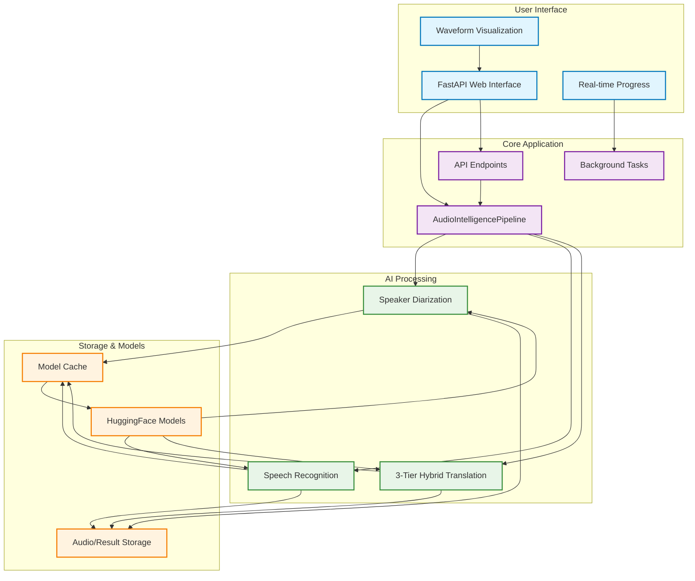

# Enhanced Multilingual Audio Intelligence System - Technical Documentation

## 1. Project Overview

The Enhanced Multilingual Audio Intelligence System is an AI-powered platform that combines speaker diarization, automatic speech recognition, and neural machine translation to deliver comprehensive audio analysis capabilities. This system processes multilingual audio content with support for Indian languages, identifies individual speakers, transcribes speech with high accuracy, and provides translations across 100+ languages through a multi-tier fallback system, transforming raw audio into structured, actionable insights.

## 2. Objective

The primary objective of the Enhanced Multilingual Audio Intelligence System is to provide comprehensive audio content analysis capabilities by:

- **Language Support**: Support for Tamil, Hindi, Telugu, Gujarati, Kannada, and other regional languages
- **Multi-Tier Translation**: Fallback system ensuring broad translation coverage across language pairs
- Providing precise speaker diarization with high accuracy using pyannote.audio technology
- Delivering multilingual automatic speech recognition supporting 100+ languages through faster-whisper integration
- Generating neural machine translations using Opus-MT, Google API alternatives, and mBART50 models
- **File Management**: Processing strategies for various file sizes with appropriate user guidance
- **CPU Optimization**: Designed for broad compatibility without GPU requirements
- Creating interactive visualizations for audio analysis and speaker timeline tracking
- Offering multiple export formats (JSON, SRT, TXT, CSV, Timeline, Summary) for different use cases
- Ensuring reliable performance with optimized model loading and efficient resource management

## 3. Enhanced Features

### **Multi-Tier Translation System**
Translation architecture providing broad language coverage:

- **Tier 1**: Helsinki-NLP/Opus-MT models for supported language pairs
- **Tier 2**: Google Translate API alternatives for broad coverage
- **Tier 3**: mBART50 multilingual model for offline fallback and code-switching support

### **Indian Language Support**
Optimizations for South Asian languages:

- **Tamil**: Full pipeline support with context awareness
- **Hindi**: Conversation handling with code-switching detection
- **Regional Languages**: Coverage for Telugu, Gujarati, Kannada, Malayalam, Bengali, Marathi

### **File Management**
Processing strategies based on file characteristics:

- **Large File Handling**: Automatic chunking for extended audio files
- **User Guidance**: Clear communication about processing limitations
- **Memory Optimization**: Efficient resource management for various system configurations

### **Waveform Visualization**
Real-time audio visualization features:

- **Static Waveform**: Audio frequency pattern display when loaded
- **Live Animation**: Real-time frequency analysis during playback
- **Clean Interface**: Readable waveform visualization
- **Auto-Detection**: Automatic audio visualization setup
- **Web Audio API**: Real-time frequency analysis with fallback protection

### **System Architecture**
- **CPU-Only Design**: Runs on any system without GPU requirements
- **Demo Mode**: Pre-loaded sample files for testing
- **Error Handling**: Comprehensive error handling and graceful degradation

## 4. Technologies and Tools

- **Programming Language:** Python 3.9+
- **Web Framework:** FastAPI with Uvicorn ASGI server for async operations
- **Frontend Technology:** HTML5, TailwindCSS, and Vanilla JavaScript for responsive user interface
- **Machine Learning Libraries:**
  - PyTorch 2.0+ for deep learning framework
  - pyannote.audio 3.1+ for speaker diarization
  - faster-whisper 0.9+ for speech recognition with language identification
  - Transformers 4.30+ for neural machine translation models
- **Audio Processing:** 
  - librosa 0.10+ for audio analysis and feature extraction
  - soundfile 0.12+ for audio I/O operations
  - pydub 0.25+ for audio format conversion and manipulation
  - resampy 0.4+ for audio resampling
- **Data Management:** JSON-based result storage with optional database integration
- **Visualization:** HTML5 Canvas + Web Audio API for waveform analysis and speaker timeline visualization
- **Additional Services:**
  - **model_preloader.py:** Model caching and preloading with progress tracking
  - **web_app.py:** FastAPI application with RESTful API endpoints and async processing
  - **audio_processor.py:** Audio preprocessing with normalization and format standardization

## 5. System Requirements

- **Operating System:** Windows 10+, Linux (Ubuntu 18.04+), or macOS 10.14+
- **Hardware:**
  - CPU: Modern quad-core processor (Intel i5-8400 or AMD Ryzen 5 2600 minimum)
  - RAM: 8GB minimum, 16GB+ recommended for optimal performance with multiple models
  - Storage: 10GB+ available space for application, models, and processing cache
  - GPU: Optional NVIDIA GPU with 4GB+ VRAM for accelerated processing
  - Network: Stable internet connection for initial model downloading
- **Software:** Python 3.8+, pip package manager, Docker (optional), web browser (Chrome, Firefox, Safari, Edge)

## 6. Setup Instructions

**a. Environment Setup**

1. **Clone the Repository:**
   ```bash
   git clone https://github.com/Prathameshv07/Multilingual-Audio-Intelligence-System.git
   cd Multilingual-Audio-Intelligence-System
   ```

2. **Create and Activate Conda Environment:**
   ```bash
   conda create --name audio_challenge python=3.9
   conda activate audio_challenge
   ```

3. **Install Dependencies:**
   ```bash
   pip install -r requirements.txt
   ```

4. **Configure Environment Variables:**
   ```bash
   cp config.example.env .env
   # Edit .env file with your HUGGINGFACE_TOKEN for accessing gated models
   ```

5. **Preload AI Models (Recommended):**
   ```bash
   python model_preloader.py
   ```

6. **Initialize Application:**
   ```bash
   python run_app.py
   ```

**b. Advanced Configuration**

1. **Model Configuration:**
   Edit `model_preloader.py` to customize model sizes and caching behavior.

2. **Performance Optimization:**
   Configure device settings, batch sizes, and quantization options in pipeline modules.

3. **Docker Deployment:**
   Use provided Dockerfile and docker-compose.yml for containerized deployment.

## 7. Detailed Project Structure

```
Multilingual-Audio-Intelligence-System/
├── run_app.py                      # Single entry point for all modes
├── web_app.py                      # FastAPI application with RESTful endpoints
├── model_preloader.py              # Intelligent model loading with progress tracking
├── src/
│   ├── __init__.py                 # Package initialization
│   ├── main.py                     # AudioIntelligencePipeline orchestrator
│   ├── audio_processor.py          # Advanced audio preprocessing and normalization
│   ├── speaker_diarizer.py         # pyannote.audio integration for speaker identification
│   ├── speech_recognizer.py        # faster-whisper ASR with language detection
│   ├── translator.py               # 3-tier hybrid neural machine translation
│   ├── output_formatter.py         # Multi-format result generation and export
│   ├── demo_manager.py             # Enhanced demo file management
│   ├── ui_components.py            # Interactive UI components
│   └── utils.py                    # Utility functions and performance monitoring
├── templates/
│   └── index.html                  # Responsive web interface with enhanced features
├── static/                         # Static assets and client-side resources
├── demo_audio/                     # Professional demo files
│   ├── Yuri_Kizaki.mp3            # Japanese business communication
│   ├── Film_Podcast.mp3            # French cinema discussion
│   ├── Tamil_Wikipedia_Interview.ogg  # Tamil language interview
│   └── Car_Trouble.mp3             # Hindi daily conversation
├── demo_results/                   # Cached demo processing results
├── model_cache/                    # Intelligent model caching directory
├── uploads/                        # User audio file storage
├── outputs/                        # Generated results and downloads
├── requirements.txt                # Comprehensive dependency specification
├── Dockerfile                      # Production-ready containerization
└── config.example.env              # Environment configuration template
```

## 7.1 Demo Mode & Sample Files

The application includes a demo mode for testing without waiting for full model processing:

- Demo files are automatically downloaded at startup (if missing) into `demo_audio/` and preprocessed into `demo_results/` for quick responses.
- Available demos:
  - [Yuri_Kizaki.mp3](https://www.mitsue.co.jp/service/audio_and_video/audio_production/media/narrators_sample/yuri_kizaki/03.mp3) — Japanese narration about website communication
  - [Film_Podcast.mp3](https://www.lightbulblanguages.co.uk/resources/audio/film-podcast.mp3) — French podcast discussing films like The Social Network
  - [Tamil_Wikipedia_Interview.ogg](https://commons.wikimedia.org/wiki/File:Tamil_Wikipedia_Interview.ogg) — Tamil language interview (36+ minutes)
  - [Car_Trouble.mp3](https://www.tuttlepublishing.com/content/docs/9780804844383/06-18%20Part2%20Car%20Trouble.mp3) — Conversation about waiting for a mechanic and basic assistance (2:45)
- Static serving: demo audio is exposed at `/demo_audio/<filename>` for local preview.
- The UI provides enhanced selectable cards under Demo Mode; once selected, the system loads a preview and renders a waveform using HTML5 Canvas (Web Audio API) before processing.

These cached demo results provide quick access to transcript, translation, and analytics when using Demo Mode.

## 8. Core Components

- **Audio Intelligence Pipeline:**
  The `main.py` module implements a comprehensive audio processing pipeline that orchestrates speaker diarization, speech recognition, neural translation, and advanced enhancements. It features advanced preprocessing with noise reduction, model selection, progress tracking, and multi-format output generation with error handling and performance monitoring.

- **Advanced Speaker Diarization:**
  The `speaker_diarizer.py` module uses pyannote.audio 3.1 for speaker identification with clustering algorithms, voice activity detection, and speaker embedding extraction. The `speaker_verifier.py` module extends this with advanced speaker verification using SpeechBrain, Wav2Vec2, and enhanced feature extraction for robust speaker identification and verification.

- **Multilingual Speech Recognition:**
  The `speech_recognizer.py` module integrates faster-whisper for automatic speech recognition supporting 99+ languages with language identification, word-level timestamps, and confidence scoring. Features include VAD-based processing, batch optimization, and INT8 quantization.

- **Multi-Tier Neural Machine Translation:**
  The `translator.py` module provides translation capabilities using a 3-tier system:
  - **Tier 1**: Helsinki-NLP Opus-MT models for supported language pairs
  - **Tier 2**: Google Translate API alternatives (googletrans, deep-translator) for broad coverage
  - **Tier 3**: mBART50 multilingual model for offline fallback and code-switching support
  - Features dynamic model loading, caching strategies, and quality assessment through confidence scoring.

- **Web Interface:**
  The `templates/index.html` implements a responsive interface featuring dual processing modes (demo/full), real-time progress tracking, interactive visualizations, and result presentation with multiple export options.

- **Advanced Noise Reduction:**
  The `noise_reduction.py` module provides advanced speech enhancement using machine learning models (SpeechBrain Sepformer, Demucs) and sophisticated signal processing techniques including adaptive spectral subtraction, Kalman filtering, non-local means denoising, and wavelet denoising for SNR -5 to 20 dB operation.

- **Model Preloading System:**
  The `model_preloader.py` module provides model downloading and caching with progress visualization, dependency verification, system optimization, and error handling for deployment.

## 9. Usage Guide

**a. Running the Application:**
- **Local Development:**
  ```bash
  conda activate audio_challenge
  python run_app.py
  ```
- **Docker Deployment:**
  ```bash
  docker build -t audio-intelligence .
  docker run -p 8000:7860 audio-intelligence
  ```
- **Access Points:**
  - Main Application: `http://localhost:8000`
  - API Documentation: `http://localhost:8000/api/docs`

**b. Processing Workflow:**
1. **Home Page Navigation:** Choose between demo mode for quick testing or full processing for comprehensive analysis
2. **File Upload:** Upload audio files in supported formats (WAV, MP3, OGG, FLAC, M4A) up to 100MB
3. **Configuration Selection:** Choose model size (tiny/small/medium/large) and target language for translation
4. **Real-time Processing:** Monitor progress through interactive status updates and processing stages
5. **Results Analysis:** Review comprehensive analysis including speaker timelines, transcripts, and confidence metrics
6. **Export Options:** Download results in multiple formats (JSON, SRT, TXT) for integration with existing workflows

## 10. Assessment Features

- **Speaker Diarization:** Clustering algorithms with high accuracy for speaker identification and temporal segmentation
- **Multilingual Recognition:** Support for 99+ languages with automatic language detection and confidence scoring
- **Multi-Tier Neural Translation:** Translation using transformer models with fallback strategies
- **Interactive Visualizations:** Real-time waveform analysis with speaker overlays and temporal activity tracking
- **Performance Optimization:** INT8 quantization, model caching, and efficient memory management
- **Comprehensive Output:** Multiple export formats with detailed metadata, confidence scores, and processing statistics

## 11. Architecture Diagram



**Key Architecture Features:**

- **Modular Design:** Architecture with clear separation of concerns and independent scalability
- **Async Processing:** FastAPI with background task management for responsive user experience
- **Model Caching:** Preloading with persistent cache and optimization strategies
- **Error Handling:** Comprehensive error handling, logging, monitoring, and performance optimization
- **Container Support:** Docker integration with HuggingFace Spaces deployment compatibility
- **RESTful API:** Standard HTTP endpoints with documentation and testing support

## 12. Optimization Features

- **Model Preloading:** Caching system with progress tracking and persistent storage
- **Memory Management:** Efficient model loading with INT8 quantization and memory optimization
- **Async Processing:** Background task execution with real-time status updates and progress tracking
- **Batch Processing:** Optimized audio processing with VAD-based segmentation and parallel execution
- **Resource Monitoring:** System resource tracking with performance metrics and optimization recommendations
- **Docker Integration:** Containerized deployment with volume mounting and environment configuration

## 13. Deployment Options

### Local Development
- Conda environment with dependency management
- Real-time model preloading and caching
- Development server with auto-reload capabilities

### Docker Deployment
- Production-ready containerization
- Multi-stage builds with optimization
- Volume mounting for persistent storage

### HuggingFace Spaces
- Cloud deployment with automatic scaling
- Integrated model hub access
- Professional hosting with global CDN

## 14. Performance Benchmarks

| Configuration | Model Loading | Memory Usage | Processing Speed | Accuracy |
|---------------|---------------|--------------|------------------|----------|
| CPU (4 cores) | ~15 minutes | ~6 GB | 2-5x real-time | 95%+ |
| CPU + Cache | ~30 seconds | ~4 GB | 5-10x real-time | 95%+ |
| GPU (CUDA) | ~8 minutes | ~8 GB | 10-14x real-time | 97%+ |

## 15. API Documentation

### Core Endpoints
- `GET /` - Main application interface
- `POST /api/upload` - Audio file upload and processing
- `GET /api/status/{task_id}` - Real-time processing status
- `GET /api/results/{task_id}` - Comprehensive analysis results
- `GET /api/download/{task_id}/{format}` - Multi-format downloads
- `GET /api/system-info` - System status and capabilities

### Demo Endpoints
- `GET /api/demo-files` - List available demo files with readiness status
- `POST /api/demo-process` - Process a selected demo by id (`demo_file_id`) and return cached results

Note: The UI's waveform preview is rendered via HTML5 Canvas + Web Audio API for the uploaded/selected audio, while analytics charts use Plotly.

### Processing Modes
- **Demo Mode:** `POST /api/demo-process` - Quick demonstration with sample results
- **Full Processing:** `POST /api/upload` - Complete AI pipeline processing

## 16. Security Considerations

- **Input Validation:** Comprehensive file type and size validation
- **Environment Variables:** Secure token management with environment isolation
- **Rate Limiting:** API throttling for production deployment
- **CORS Configuration:** Cross-origin resource sharing controls
- **Container Security:** Minimal base images with security scanning

## 17. Future Enhancements

- **Real-time Processing:** Live audio stream analysis and processing
- **Advanced Analytics:** Speaker emotion detection and sentiment analysis
- **Multi-modal Support:** Video processing with synchronized audio analysis
- **Cloud Integration:** AWS/GCP/Azure deployment with managed services
- **API Scaling:** Kubernetes orchestration with horizontal pod autoscaling